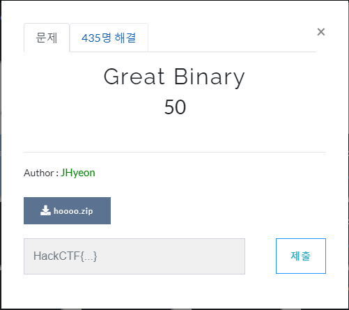
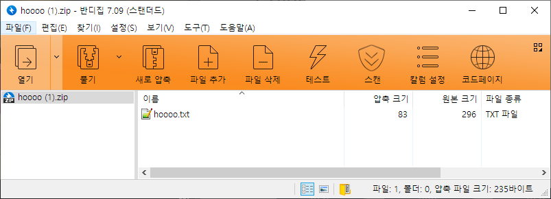
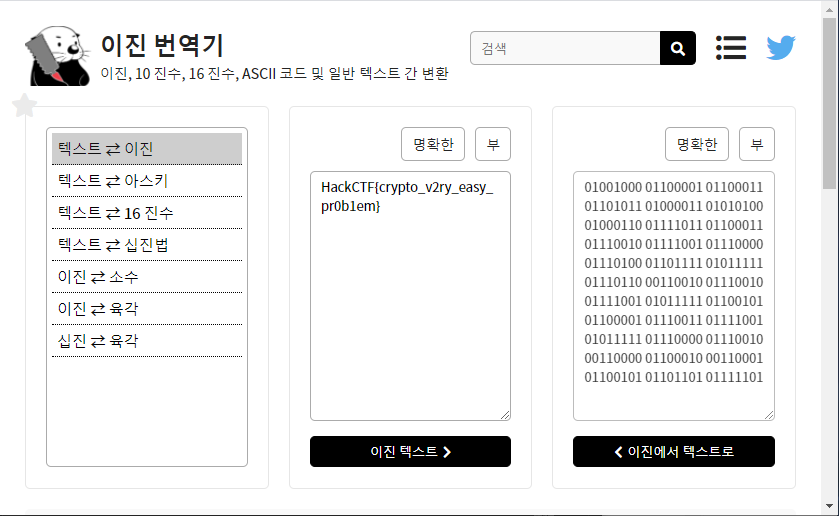

# 문제 정보
1. 문제 링크: [Link](https://ctf.j0n9hyun.xyz/challenges#Great%20Binary)
2. 문제 푼 날짜: 2020-08-29
3. 분류: Cryptography
4. 문제 이름: Great Binary

# 문제 푼 과정



문제를 선택했을 때 'hoooo.zip'이라는 파일을 발견하였다.



파일을 다운로드 후 열으면 'hoooo.txt'라는 텍스트 파일이 들어있는 것이 보인다.

txt 파일에는
```txt
01001000 01100001 01100011 01101011 01000011 01010100 01000110 01111011 01100011 01110010 01111001 01110000 01110100 01101111 01011111 01110110 00110010 01110010 01111001 01011111 01100101 01100001 01110011 01111001 01011111 01110000 01110010 00110000 01100010 00110001 01100101 01101101 01111101
```
로 8bit 2진수가 저장되어있다.

2진수 -> 어떤 형태
처럼 바꿔야 알아볼 수 있을 것 같다.

떠오른 방법은
2진수 -> ASCII(아스키) 하나 밖에 없는 거 같다.


[https://ko.rakko.tools/tools/74/](https://ko.rakko.tools/tools/74/)

2진수를 쉽고 간편하게 하기 위해
여러 변환기를 가진 사이트를 사용했다.

ascii로 변환해 보자.



'암호 매우 쉬운 문제'라는 플래그가 떳다.