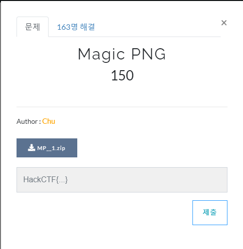
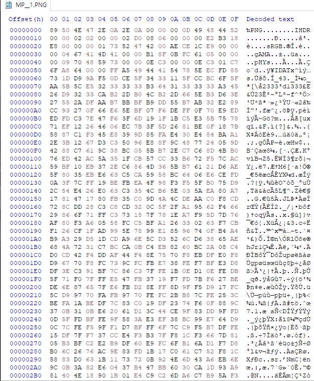
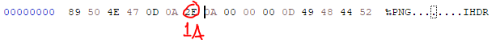
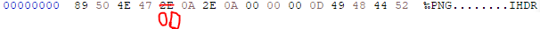
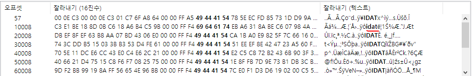

# 문제 정보
1. 문제 링크: [Link](https://ctf.j0n9hyun.xyz/challenges#Magic%20PNG)
2. 문제 푼 날짜: 2020-09-25
3. 분류: Forensics
4. 문제 이름: Magic PNG

# 문제 푼 과정

Web  문제인 Magic PNG를 풀어 보겠다.

한개의 압축 파일이 주어 진다.

안에 png 파일이 주어 지는데

PNG가 열리지 않는다.

HxD로 열어 확인해 보니

일부 시그니처가 조금씩 다르다.

원래 PNG의 시그니처로 전부 고쳐보니

사진이 정상적으로 출력되고 플래그가 보인다.