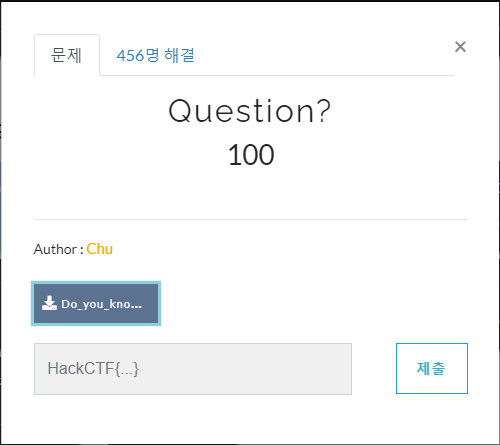
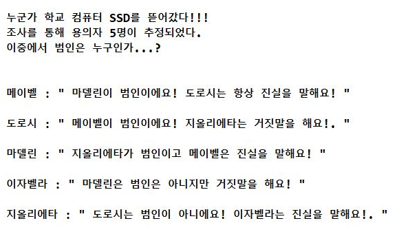
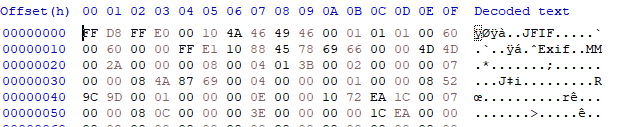
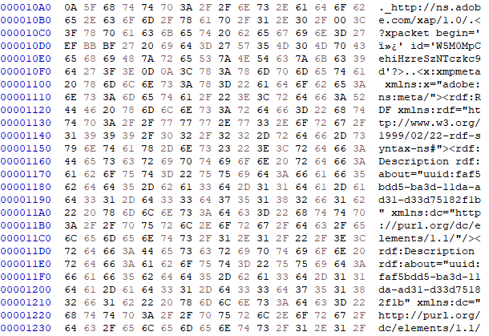
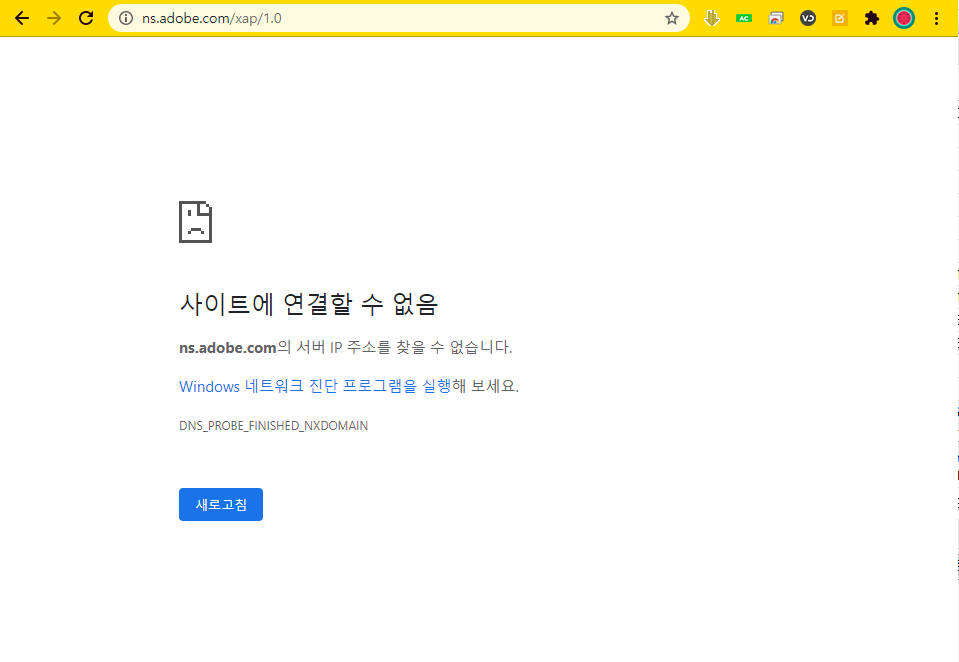
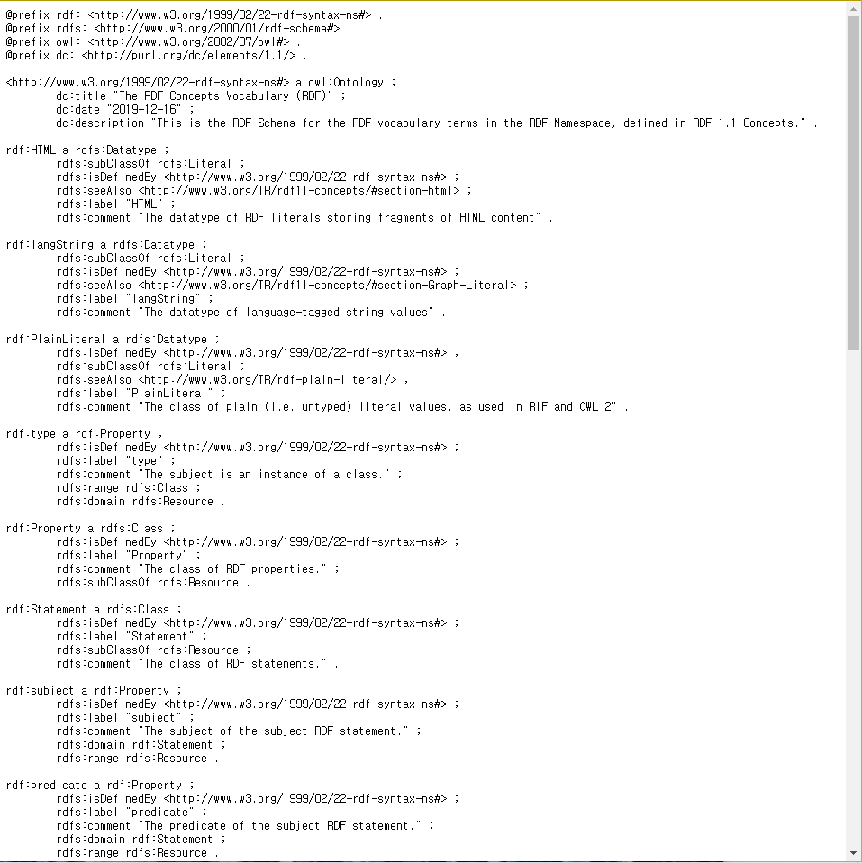
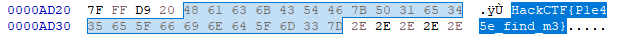

# 문제 정보
1. 문제 링크: [Link](https://ctf.j0n9hyun.xyz/challenges#Question?)
2. 문제 푼 날짜: 2020-08-30
3. 분류: Forensics
4. 문제 이름: Question?

# 문제 푼 과정

문제를 선택하면 "Do_you_know_Hxd.zip" 파일이 보인다.
zip 파일 안에는 이미지 파일인 jpg이 있으니 열어 보았다.

사진에는 "누군가 학교 컴퓨터 SSD.." 그러고 보니 "문제를 푼다 해도 글자가 정상적인 플래그를 본적이 없고 Hxd는 파일을 열어 16진수로 표시하는 편집기인데 무슨 상관이 있을까?" 라는 생각이 들었다. 그러니 Hxd를 먼저 실행해 보았다.

Hxd 에서는 16진수 표시 외에 오른족에 텍스트로 바꿔주는 기능이 있다.
파일을 살펴보자.

"미스터 츄~" 가 보인다...

그리고 Hxd에서 수상한 어도비 URL과 월드 와이드 웹 표준 개발 기구 URL가 발견되었다.

 [Link](http://www.w3.org/1999/02/22-rdf-syntax-ns#)

사이트는 뭔가 복잡해 보인다. 웹사이트를 들어가면 또 다른 URL이 여러개 나오고 또, CTF 사이트을 위해 Adobe와 W3c가 도움을 줄 가능성이 매우 적고, 강제로 올린다면 불법이기 때문에 가능성이 매우 낮다고 생각해서 빠져 나왔다.

혹시 모르니 Ctrl + F 를 이용해서 flag의 일부분인 "Hack"를 검색해 보았다.

플래그가 출력되었다.