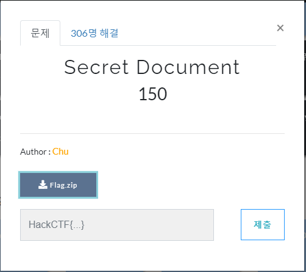
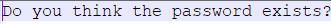
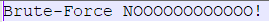
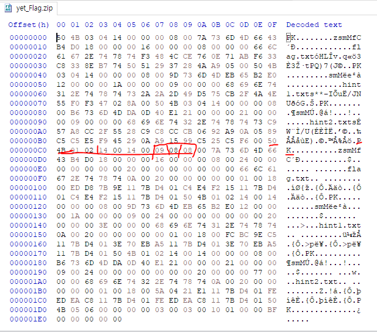
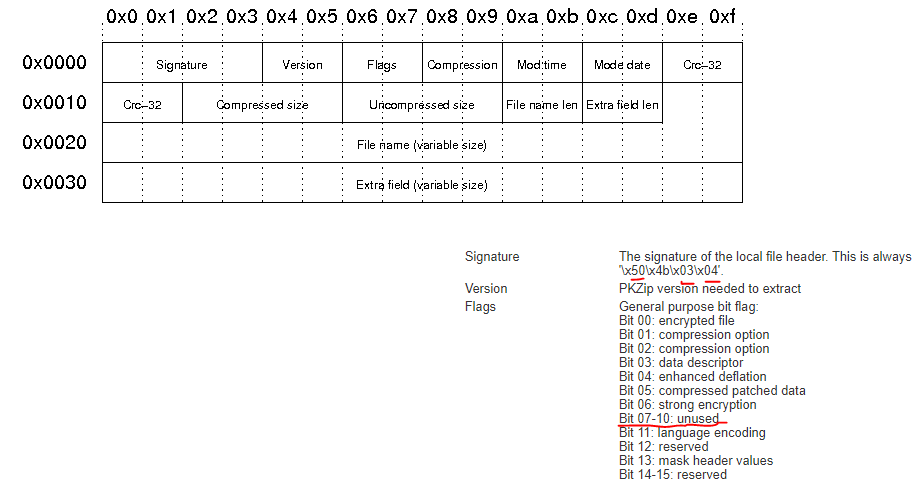
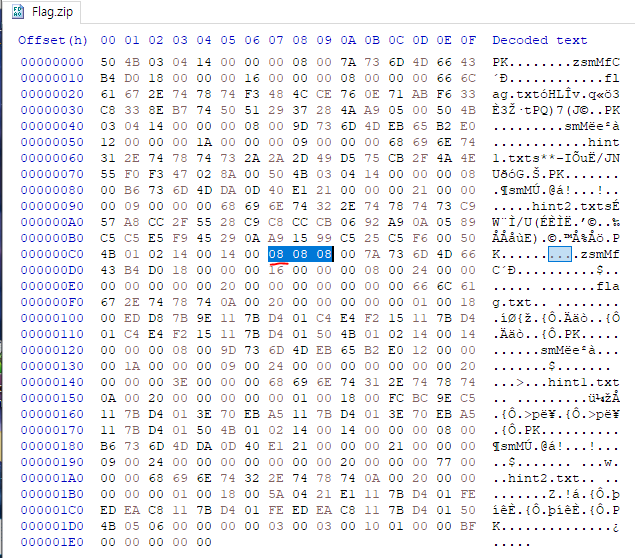
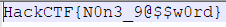

# 문제 정보
1. 문제 링크: [Link](https://ctf.j0n9hyun.xyz/challenges#Secret%20Document)
2. 문제 푼 날짜: 2020-09-23
3. 분류: Forsensics
4. 문제 이름: Secret Document

# 문제 푼 과정

포렌식 문제 '/Secret Document'를 풀어 보겠다.

문제를 보면 'Flag.zip'이라는 압축 파일이 보인다.

그래서 Zip 파일을 확인했는데 Flag.txt가 있기에 열어보려니 암호가 걸려 있다고 나온다.

파일 안에는 힌트가 두개가 있다.

1번째는 압축 파일에 '무차별 대입 공격'을 하지 말라고 하며

2번째는 '당신은 패스워드가 존재한다고 생각하는가?' 라고 쓰여 있다.

뭔가 이상하여 HxD로 열어 보니

flag.txt에서 ZIP 플래그쪽에 이상한 것을 발견하였다.

[플래그란?] 사진 출처: [https://users.cs.jmu.edu/buchhofp/forensics/formats/pkzip.html](https://users.cs.jmu.edu/buchhofp/forensics/formats/pkzip.html)

ZIP 파일은 0x0 ~ 0x3 까지는 파일의 시그니처 0x4,5는 버전  0x6~0x7까지는 Zip 파일의 플래그 인데 이 플래그((출처: 위키백과)컴퓨터에서 무언가를 기억하거나 또는 다른 프로그램에게 약속된 신호를 남기기 위한 용도로 프로그램에 사용되는 미리 정의된 비트)가 Zip 의 상태를 설정한다.

즉 이처럼 08로 일치 시켜주면 파일의 암호가 풀릴 것이다.

플래그 파일이 열렸다.