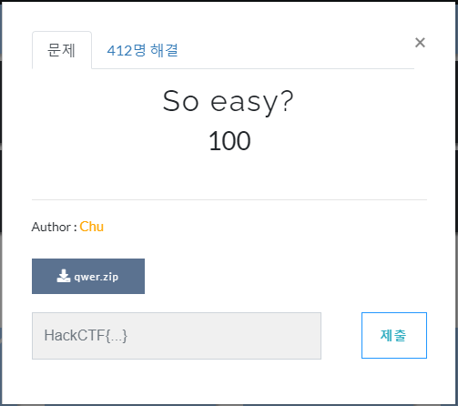
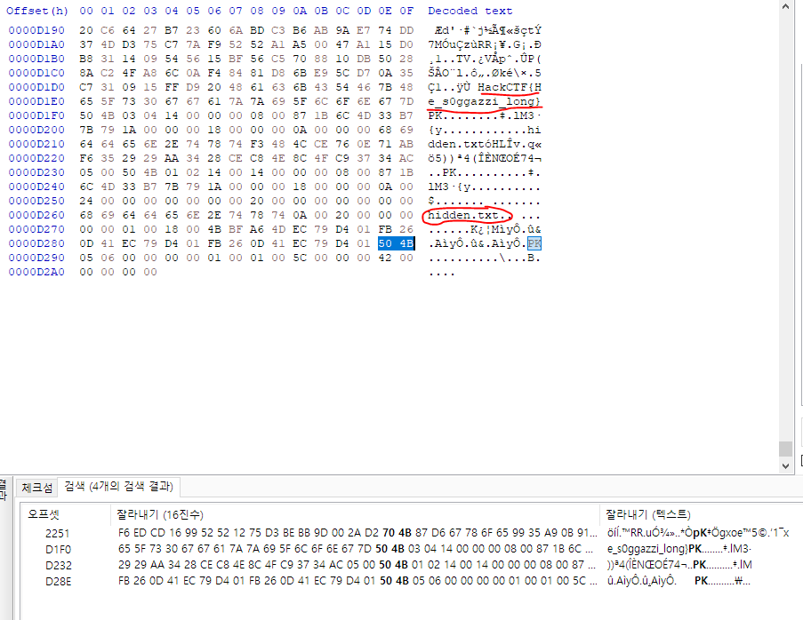
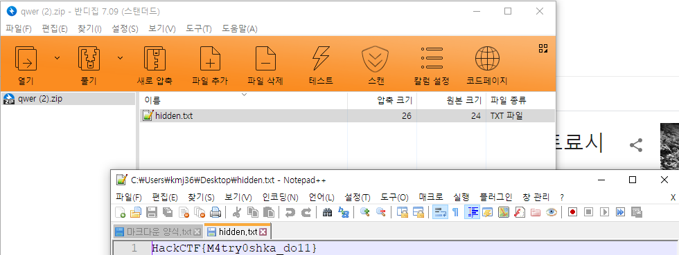

# 문제 정보
1. 문제 링크: [Link](https://ctf.j0n9hyun.xyz/challenges#So%20easy?)
2. 문제 푼 날짜: 2020-09-24
3. 분류: Forensics
4. 문제 이름: So easy?

# 문제 푼 과정

포렌식 문제 중 한가지인 'So easy?'를 풀겠다.

문제는 Zip 파일이 존재한다.

파일을 여니 마트료시카 그림의 jpg 파일이 나온다.

일단 jpg 파일이 나왔으니 HxD로 뜯어 보자.

HxD로 뜯으니 JPG 헤더 시그니처가 올바른데 Zip 파일의 시그니처가 섞어있다. 또

위에 플래그가 보이는데..

HackCTF{'힣!_ ㅅㅗㄱ았쮜 _LOOONG~'} 이라고 보인다...

일단 HxD로 파일의 비트를 수정하는 것은 아니고 hidden.txt 가 포함되어 있는 것을 보아

그림을 zip 파일로 확장자를 변경하고 열어보니 진짜 플래그가 나왔다.