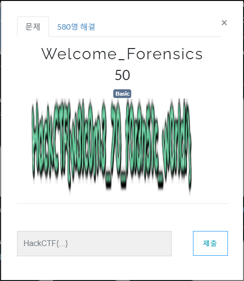

# 문제 정보
1. 문제 링크: [Link](https://ctf.j0n9hyun.xyz/challenges#Welcome_Forensics)
2. 문제 푼 날짜: 2020-08-23
3. 분류: Forensics
4. 문제 이름: Welcome_Forensics

# 문제 푼 과정
첫 포렌식 문제를 풀어 보기로 했다.

문제를 풀기 위해 클릭했을 때 옆으로 매우 눌린 플래그 사진이 반짝이고 있는 것이 보인다.

일단 html를 확인하면 이미지의 원본이 이렇게 찌그러져 있지않다는 것을 확인했다.

사진을 오른쪽 클릭 후 새 탭으로 열어보았더니

알아볼 수 있는 플래그 사진이 나왔다.

(사실 저정도만 찌그러진 사진은 보고도 풀 수 있다..ㅋㅋ)