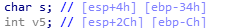

# 문제 정보
1. 문제 링크: [Link](https://ctf.j0n9hyun.xyz/challenges#Basic_BOF%20#1)
2. 문제 푼 날짜: 2020-09-11
3. 분류: Pwnable
4. 문제 이름: Basic_BOF 1

# 문제 푼 과정

문제를 보면 nc ctf.j0n9hyun.xyz 3000 으로 접속할 수 있는 주소랑, 'bof_basic' 라는 바이너리 파일이 보인다.

그러므로 먼저 Hex 값을 확인하기 위해 HxD를 사용해서 열어보자.

HxD로 파일를 열어보니 프로그래밍 언어와 비슷한 문장이 보이니 프로그램 파일 같이 보인다. 그러니 IDA로 분석을 해봐야 하는데 32bit 인지 64bit인지 알아야 한다.

바이너리 파일을 exeinfope 열어보니 32 bit 인 것을 확인할 수 있었다.

일단 파일에 걸려 있는 보안을 확인하기 위해 checksec로 확인한 결과 NX에 보안이 걸려있는 것이 보인다. 즉 입력값으로 쉘코드를 입력할 수 없다는 것이다.

IDA 32bit 버전으로 열어 보니('Binary file'로 열면 디컴파일러가 작동하지 않는다.)
어셈블리어가 출력되었다. 아직 어셈블리어를 읽기 힘드니 디 컴파일러를 실행하여 C언어로 바꿔서 보기 위해 'F5'를 눌러 보자.

어셈블리어가 C언어로 바꼈다. main의 코드를 보니 숫자가 보이는데 숫자를 16진수로 바꾸자 정상적으로 표시되었다. 이로써 정상적으로 분석할 수 있게 되었다. 이제 코드를 분석해 보자.

 표준 입력으로 45 byte를 받고 문자열 s에 저장한다.

 v5의 값이 출력되고,
v5가 0x4030201 이 아니며 v5가 0xDEADBEEF 가 아닌 경우 "\nYou are on the right way!" 출력

 v5가 0xDEADBEEF 인 경우 system() 함수가 Shell를 열어준다.

변수를 보니 esp 포인터(스택 머리 포인터)이다. 파일이 Intel CPU 기준이라서 스택이 거꾸로이다.

즉 이렇게 메모리가 할당되어 있다는 것이다. 문자열 s는 40 byte가 할당되었고, v5는 12 byte를 할당받았다.

그런데 특이한 것은 s가 45까지 받을 수 있다. 그러면 할당 받은 s를 벗어나 v5에 값을 쓸 수 있다는 것이다.

파이썬 Pwntools 모듈로 공격 코드를 프로그래밍 해보았다. nc로 ctf.j0n9hyun.xyz 3000를 접속해서 s 에 40 byte 아무런 값을 주고 v5에 리틀엔디안으로 '0xDEADBEEF'를 덮어씌우자.

공격이 성공하였고, Shell 이 실행되었다. 그리고 디렉터리를 확인하니 플래그가 발견되었다.