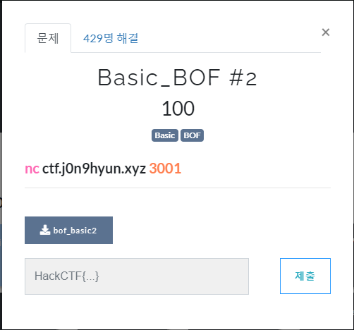
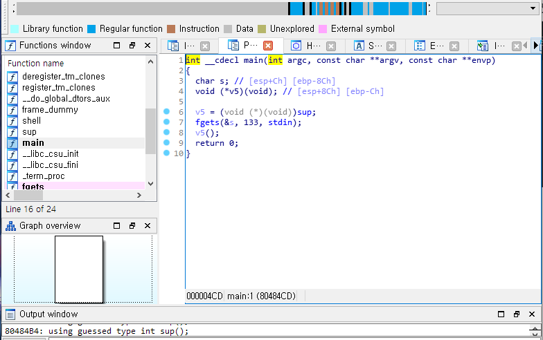
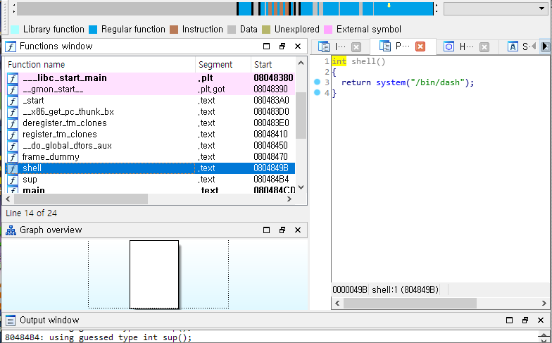
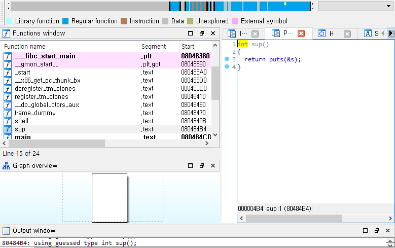
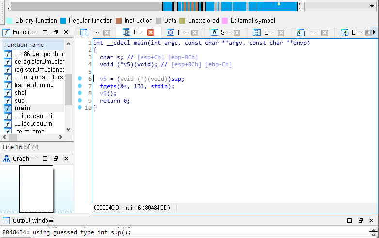
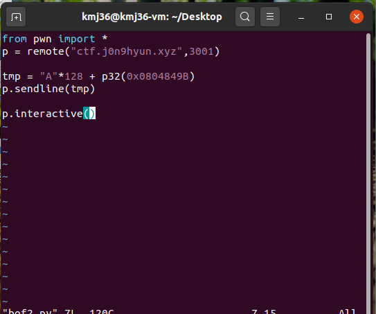
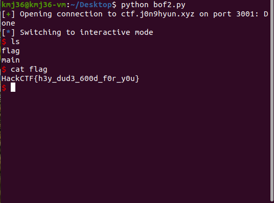

# 문제 정보
1. 문제 링크: [Link](https://ctf.j0n9hyun.xyz/challenges#Basic_BOF%20#2)
2. 문제 푼 날짜: 2020-09-16
3. 분류: Pwnable
4. 문제 이름: Basic_BOF #2

# 문제 푼 과정

HackCTF 포너블 문제인 Basic_bof2 를 풀어보겠다. 저번 Basic_bof1과 비슷한 방법으로 문제가 풀릴 것으로 예상된다. 문제를 보면 저번 문제와 비슷하게 바이너리 파일과 링크가 보인다.

일단 먼저 리눅스로 할 작업을 먼저 해보자.
file은 32 bit이고 checksec를 돌려보니 NX 쪽만 보안이 걸려있는 것이 저번 문제와 똑같이 걸려있다.

그리고 ida로 열어 보니 main과
sup 함수, Shell 함수가 존재하는 것을 보았다.

Shell 함수는 System 함수를 통해 쉘를 열어준다.
또 ida의 함수 이름에서 함수가 '0x0804849B' 에서 시작한다고 알려주고 있다.

sup 함수는 반환으로 문자 s의 주소를 입력한다.

main의 변수를 살펴 보자 main에서는 void 포인터 v5에 sup 함수를 입력받고
fgets() 함수를 통해서 stdin 표준입력으로 133 바이트를 입력받고 s에 저장한다.
그리고 v5() 를 실행한다. 또 변수끼리 ebp 기준으로

문자 S와 void 포인터 v5의 거리는 8C-C=80(140-12 = 128)
void 포인터 v5와 스택의 바닥의 거리는 C(12)이다.

마지막으로 바이너리의 정보를 조합해보면

문자 S = 128 떨어짐
void v5 = 12 떨어짐

Shell() 함수의 주소가 표시됨 '0x0804849B' 등이다.

이렇게 공격 코드를 짜보았다. 문자 s를 fgets()로 입력 받을 때 s의 1 바이트를 바로 벗어나 v5의 위치까지 아무런 char 문자로 128 void 포인터 v5로 접근하여 함수 Shell()를 리틀 엔디안으로 실행시킨다.

공격이 성공하였고 디렉터리에 flag가 보인다.