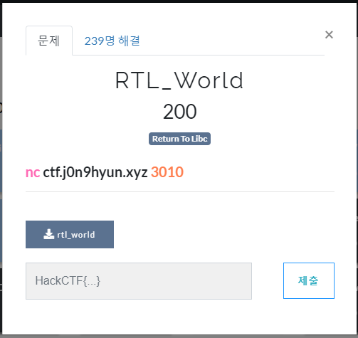
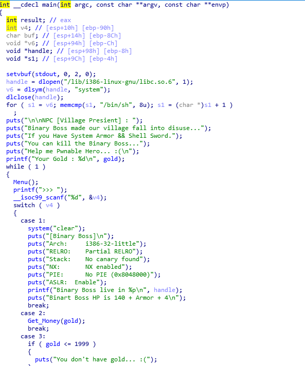
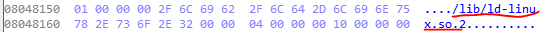
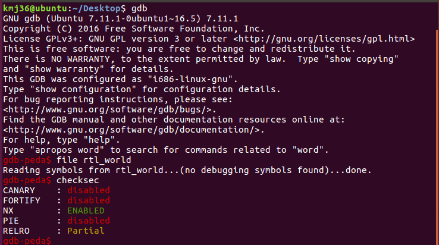
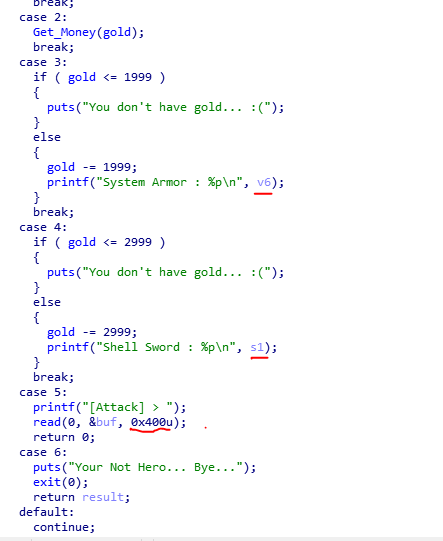
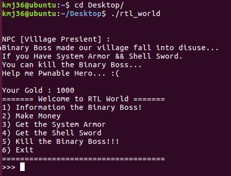
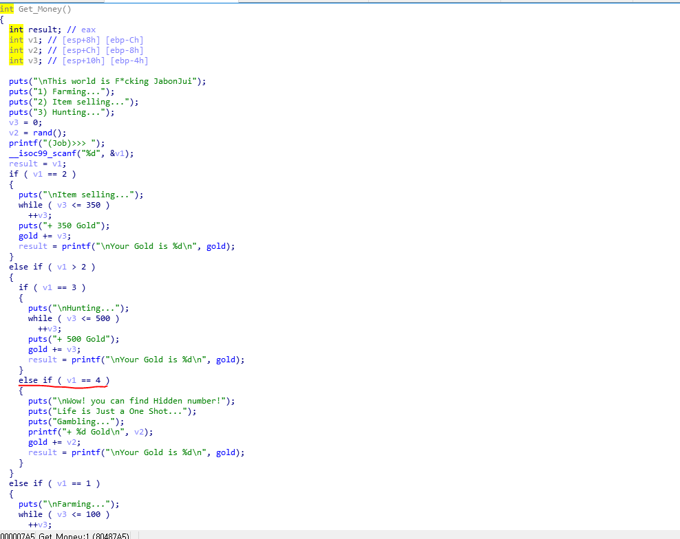
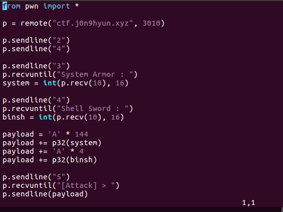
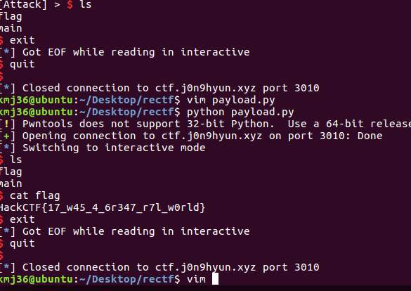

# 문제 정보

1. 문제 링크: [Link](https://ctf.j0n9hyun.xyz/challenges#RTL_World)
2. 문제 푼 날짜: 2020-11-11
3. 분류: Pwnable
4. 문제 이름: RTL_World

# 문제 푼 과정

문제 RTL_World를 풀어 보자. (본인 최근에 프로젝트때문에 간간히 쉬었다가 다시 시작한다.)

언제나 그랬듯이 바이너리가 있다.

문제가 상당히 콘솔창 기반 게임의 형태를 띄고 있다. 

[주요 변수 목록]

1. [v6(void pointer)] 동적 linux libc의 system 함수 주소를 가지고 있다.
2. [s1(void pointer)] v6에서 찾아낸 "/bin/sh" 주소를 가지고 있다.
3. [gold(int)] 골드가 있어야 system 주소와 "/bin/sh" 주소를 알 수 있다.

문제에서 주의할 점이 linux libc는 정적이 아닌 동적이라서 주소가 계속 달라진다.

또한,

NX 비트가 활성화되어 있어서 쉘코드를 실행하는 것을 막는다. 즉 문제에 맞게 rtl(return to libc)로 풀어야 한다.

IDA를 더 둘러보니 5번 케이스에 bof를 할 수 있는 취약점이 보인다.

시작은 1000골드 이며 3, 4번의 주소를 얻기 위해서 4998 골드이어야 한다.

그러니까 원래 2번에서 자본주의에 맞게 돈을 벌어야한다.

그런데 Get_Money 함수에서

4번 케이스에 이스터 에그가 있다.

랜덤으로 골드가 들어오는데 계속 돌려보니 처음은 무조건 높은 값이 나온다.

높은 값이 나오니 한번만 돌리면 되겠다.

1. 골드 이스터에그를 받고 3,4 주소를 받은 후

2. BOF buf 크기 140+sfp(32bit) 4으로 이동 후

3. ret 함수 반환 주소를 system으로 설정 후

4. system에서 4 bytes 이동

5. system에서 "/bin/sh" 실행

플래그가 잘 나온다.