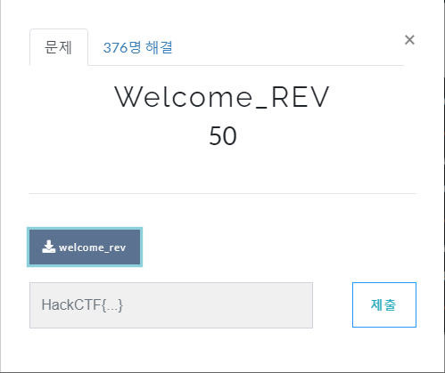
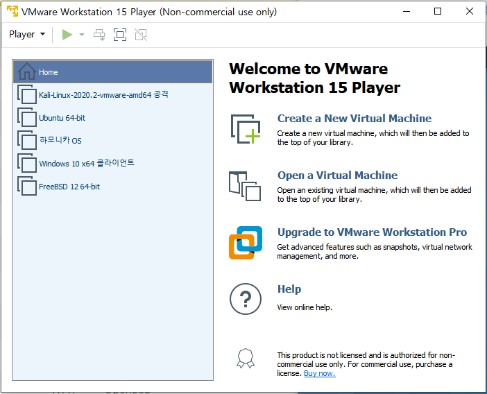
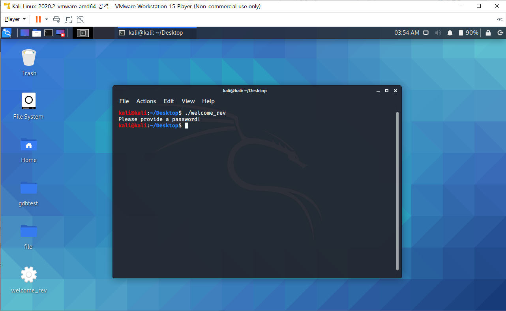
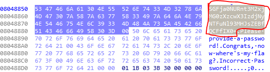
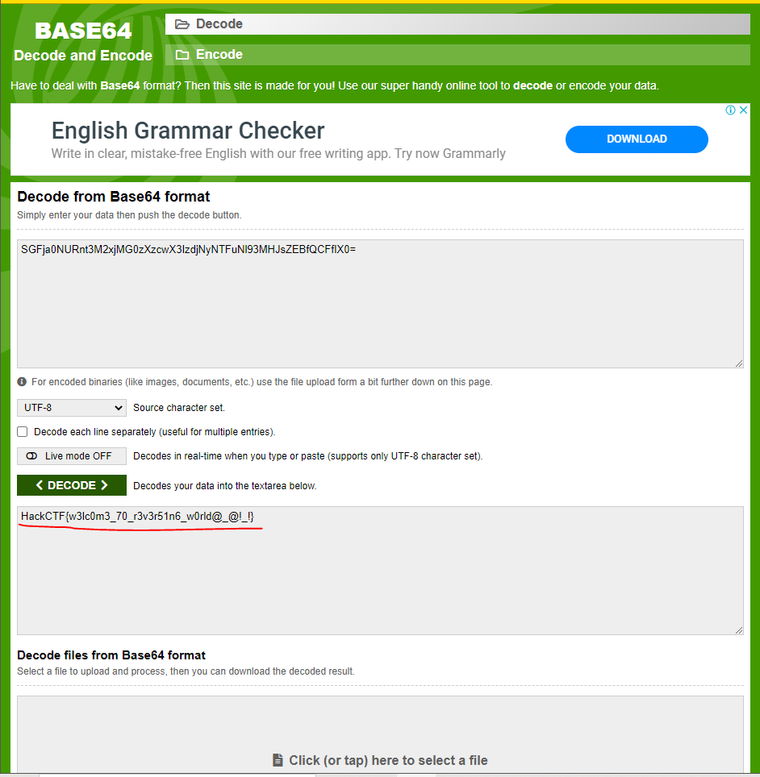

# 문제 정보
1. 문제 링크: [Link](https://ctf.j0n9hyun.xyz/challenges#Welcome_REV)
2. 문제 푼 날짜: 2020-08-31
3. 분류: Reversing
4. 문제 이름: Welcome_REV

# 문제 푼 과정

HackCTF의 Reversing 첫번째 문제인 'Welcome_REV' 문제를 풀어 보자.
문제에는 "welcome_rev"라는 바이너리 파일이 보인다.

바이너리 파일을 먼저 Vmware를 사용해서 리눅스를 열어보았다.
터미널로 './'를 앞에 붙여 실행해보자.

바이너리 파일은 프로그램 파일인 것을 확인할 수 있다.
프로그램 파일을 IDA로 열어 보았다.

'F5'를 눌러 어셈블리어를 C언어 의사코드형식 변경하였는데 플래그값으로 보이는 문자열이 보이지 않는다. 비밀번호를 맞춘다고 하여도 'Congrats, now where's my flag?'를 출력하는 것을 볼 수 있다.

16진수 형태로도 확인해 보니 [08048850 ~ 080488D0]까지 문자열이 모여 있는 부분이 보인다. 일반적인 문자열 외 특이한 문자열이 보인다.

 [Link](https://www.base64decode.org/)

문자열의 형태는 Base64형태의 문자열이며, 복호화하니 플래그가 보인다.