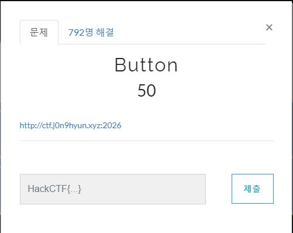
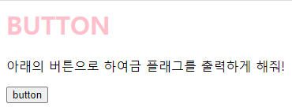
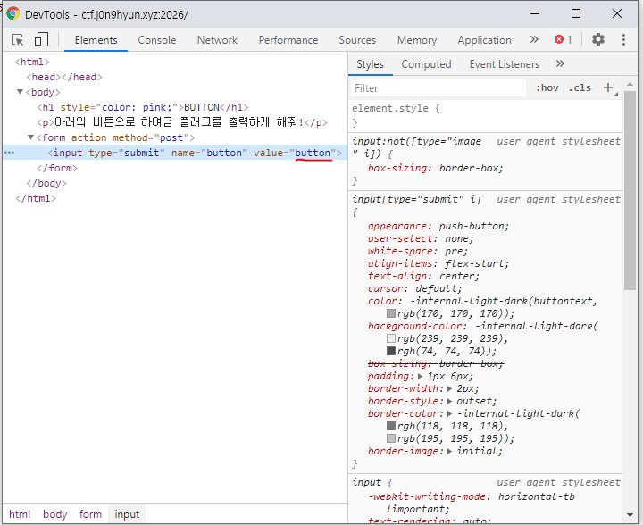
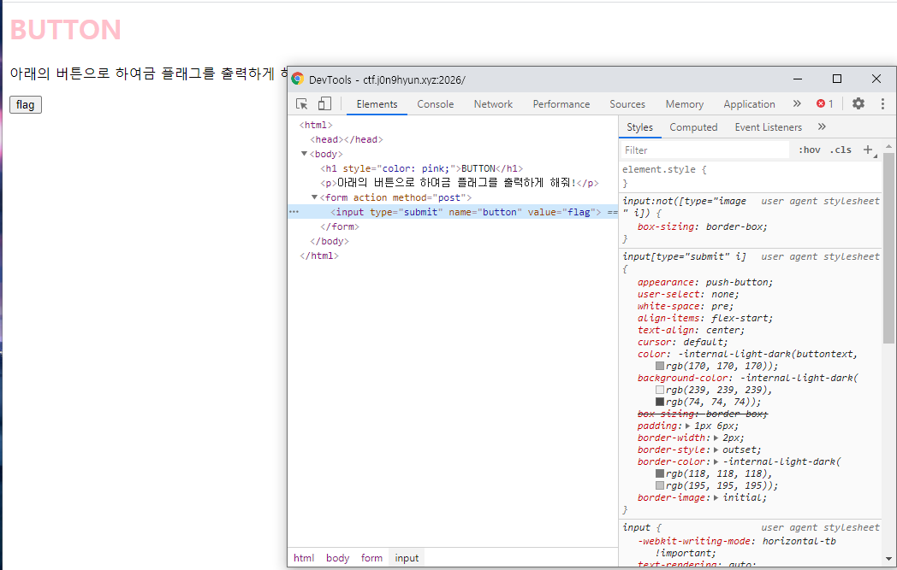
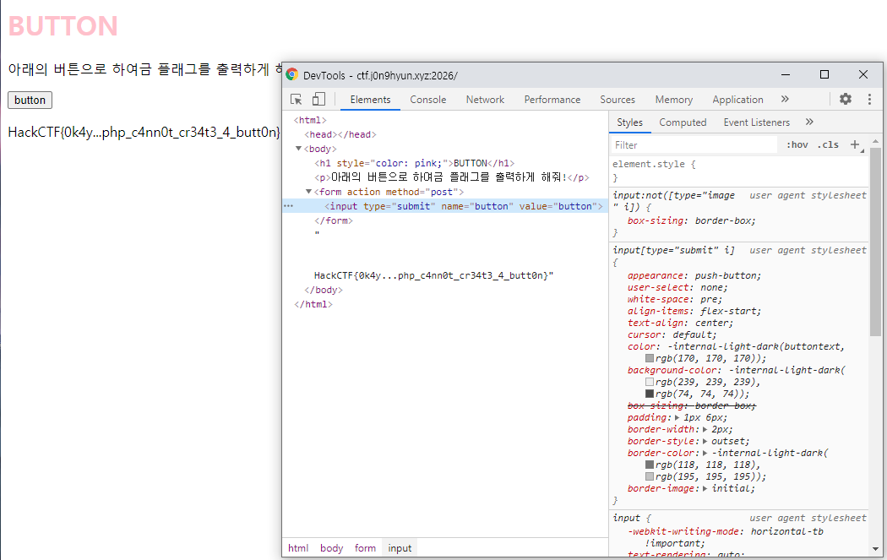

# 문제 정보
1. 문제 링크: [Link](https://ctf.j0n9hyun.xyz/challenges#Button)
2. 문제 푼 날짜: 2020-09-23
3. 분류: Web
4. 문제 이름: Button

# 문제 푼 과정

Web 문제인 Button 를 풀어보겠다.

문제를 보면 링크가 주어진다.

페이지를 보면 버튼으로 플래그를 출력하게 해달라는데  버튼을 눌러보 아무런 반응이 없다.

html를 확인해 보니 값이 button인 것이 보인다. 일단 서버에 전송되는 값을 'flag'로 바꿔보자.

flag가 출력되었다.

플래그는 '그래... php는 버튼을 생성 할 수 없어.' 라고 나온다.

즉 html을 이용해야 버튼을 만들 수 있다는 것같다.