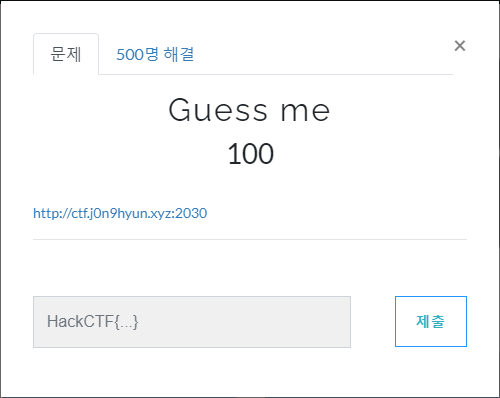
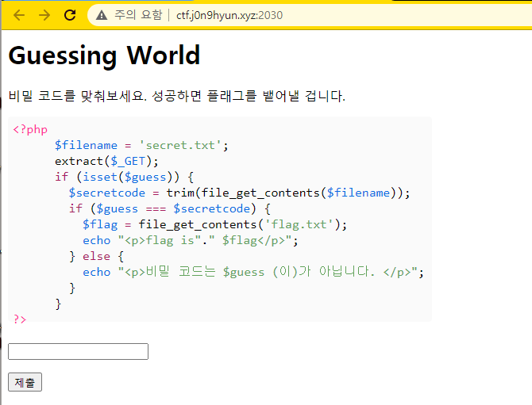
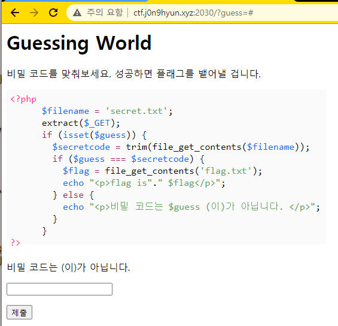
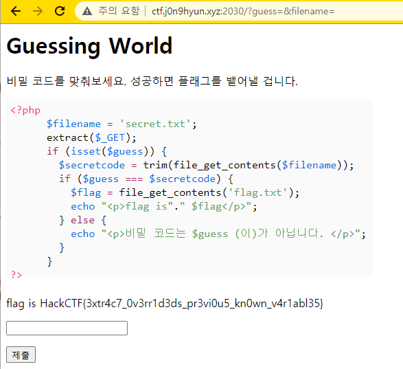

# 문제 정보
1. 문제 링크: [Link](http://ctf.j0n9hyun.xyz:2030/)
2. 문제 푼 날짜: 2020-09-25
3. 분류: Web
4. 문제 이름: Guess me

# 문제 푼 과정

Web 문제인 'Guess me'를 풀어 보겠다.

링크 하나가 주어진다.

웹에 들어가면 php 코드와 입력칸, 제출 버튼이 있다.

먼저 제출 버튼을 눌러 보니

웹 링크에 정보가 전달되는 것을 볼 수 있었다.

코드를 보면 마지막에 guess 와 secretcode를 같은 지 비교하는 데 만약 guess 와 secretcode가 NULL로 같아도 똑같이 작동할거 같은 예감이 들어 '?guess&filename='을 넣어보니

guess = NULL

secretcode = trim(file_get_contents(NULL))

이 되어 같아져 플래그가 출력되었다.

