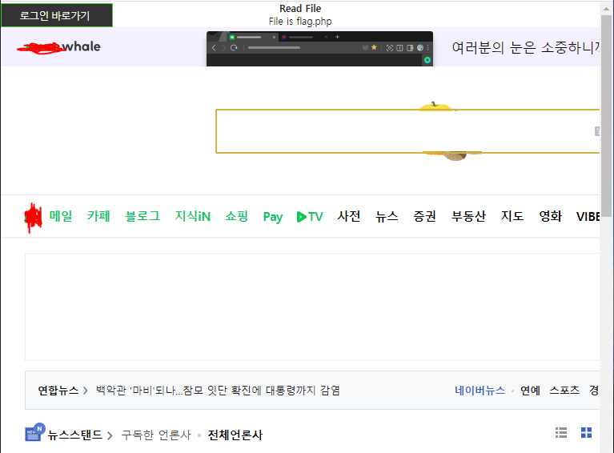
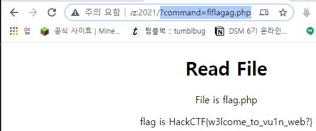

# 문제 정보
1. 문제 링크: [Link](http://ctf.j0n9hyun.xyz:2021/)
2. 문제 푼 날짜: 2020-09-25
3. 분류: Web
4. 문제 이름: Read File

# 문제 푼 과정

Read File를 풀어 보겠다.

링크가 주어진다.

들어가 보니 구글을 끌어 온 것으로 보인다.

네이버의 URL를 적어보니

네이버도 끌어 오는 것으로 보인다.

즉 command에 파일의 위치를 적으면 그 파일을 끌어 오는 것으로 보인다.

그래서 flag.php 를 command에 적었는데 똑같이 작동하지 않는다.

그래서 뒤에 네이버를 붙였더니

같은 화면이 나왔다.

flag라는 단어를 필터링하고 있는 것으로 보인다.

'flag'라는 단어를 필터링해도 flag가 되도록 'fl'과 'ag'사이에 flag라는 단어를 넣어 fl(flag)ag.php가 되어서 플래그를 불러 올 수 있었다.

