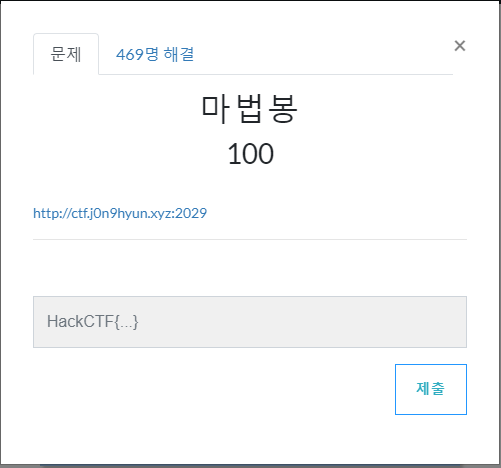
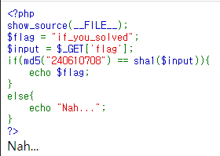
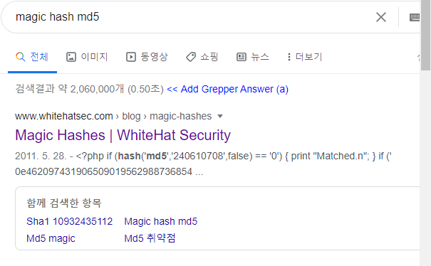
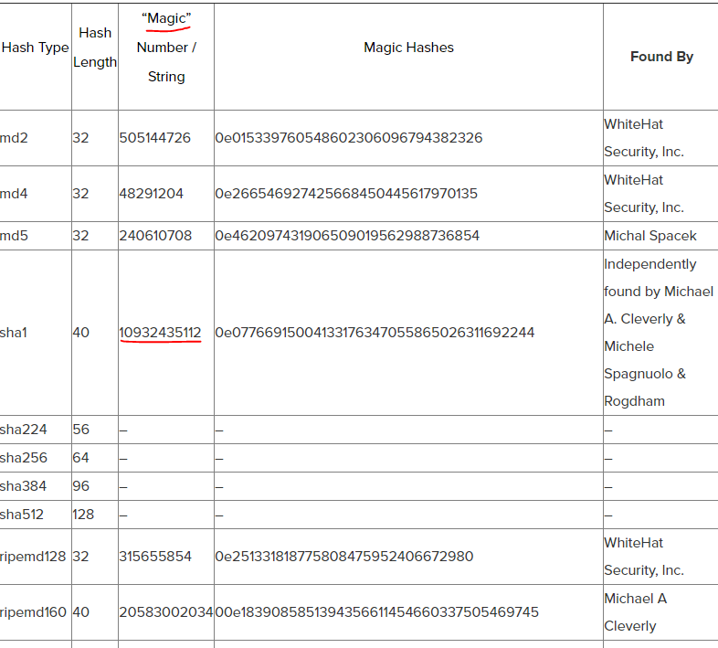
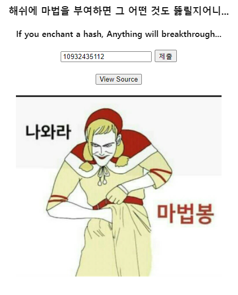
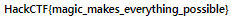

# 문제 정보
1. 문제 링크: [Link](https://ctf.j0n9hyun.xyz/challenges#마법봉)
2. 문제 푼 날짜: 2020-09-25
3. 분류: Web
4. 문제 이름: 마법봉(?)

# 문제 푼 과정

Web 문제인 마법봉(?)를 풀어보겠다.

문제를 보면 링크가 하나 주어지는데

누가 봐도 손의 위치가 이상한 그림이 나온다.

그 외 '해쉬에 마법을 부여하면 그 어떤 것도 뚫릴지어니...'라고 써있다.

소스 보기를 누르니 php 소스가 나오는데

코드를 보면 입력한 값이 sha1로 암호화되어 md5 와 비교를 하여 같으면 flag를 출력한다.

어떻게 풀지 고민하다가 문제의 제목과 글, 사진에서 힌트를 찾았다.

계속 '마법'이란 단어를 반복해서 사용하고 해쉬에 마법를 부여한다고 하여

php의 취약점인 'Magic Hash'(서로 다른 값이 같은 값으로 인식하도록하는 특수동작)를 구글링하니

구글에 실제로 있었다.

md5를 보면 같은 숫자를 발견할 수 있으며 sha1로 이와 비슷한 값을 찾을 수 있었다.

값을 입력하니 플래그가 출력되었다.