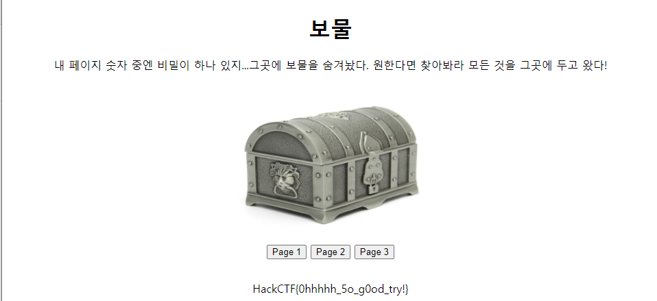

# 문제 정보
1. 문제 링크: [Link](http://ctf.j0n9hyun.xyz:2025/)
2. 문제 푼 날짜: 2020-09-24
3. 분류: Web
4. 문제 이름: 보물

# 문제 푼 과정

Web 문제인 보물 문제를 풀어 보겠다.


문제에는 웹페이지 링크가 하나 주어진다.


웹에서는 페이지 1,2,3과 보물을 숨겨놨다고 한다.

페이지 숫자 1를 눌러 보자.


페이지 1를 누르니 어떠한 해쉬값이 나온다.

테스트로 숫자를 무작위로 넣어보자.


무작위 값을 넣어도 페이지에 해쉬값이 주어진다.

```python
import requests
i=1

while True:
    URL = 'http://ctf.j0n9hyun.xyz:2025/?page=' + str(i)
    if "HackCTF{" in requests.get(URL).text:
        print("Here: " + URL)
        break
    else:
        print("Not Here: " + str(i))
        i+=1
```

파이썬으로 블루트 포스로 탐색을 해보자.

무한반복 중 웹페이지 코드에 'HackCTF{'' 라는 단어가 포함되어 있으면 웹페이지 링크를 출력한다.


코드를 돌리니


1225에서 무언가 잡힌다.



플래그를 발견하였다.