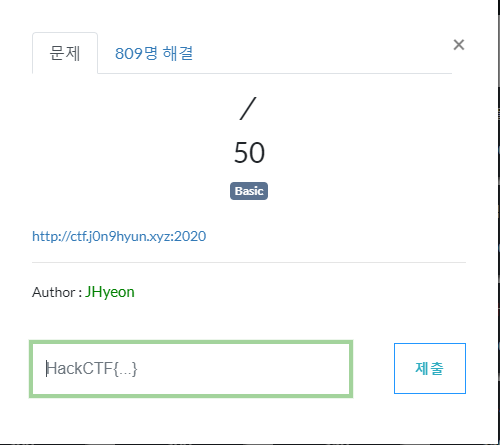
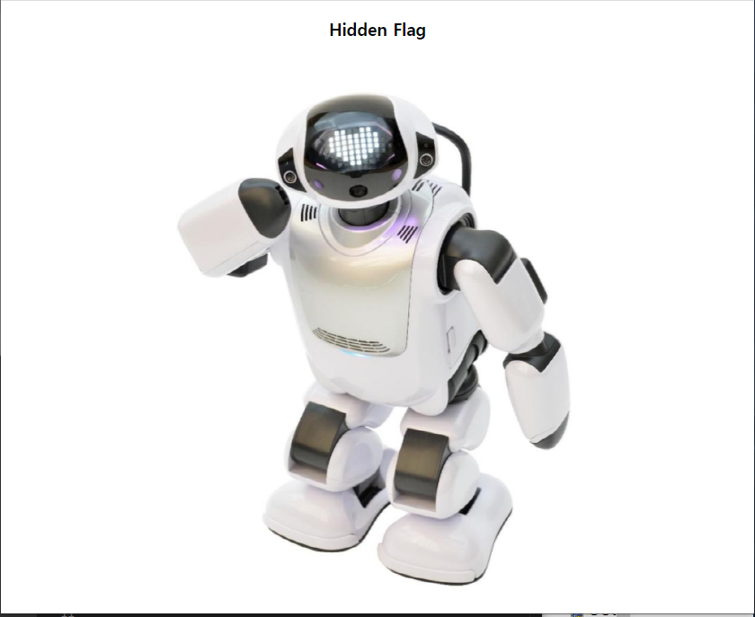
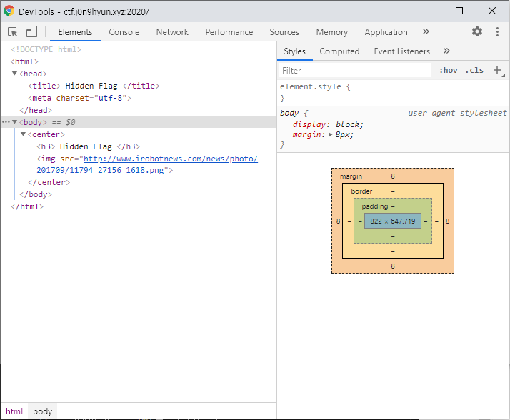
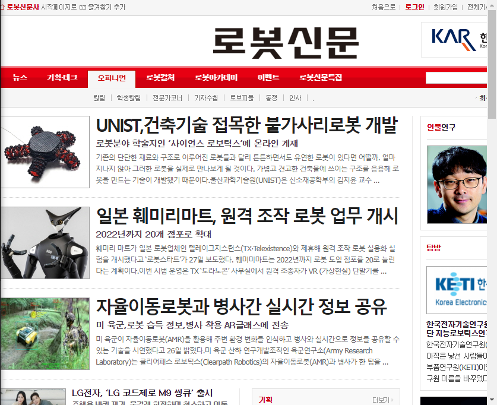
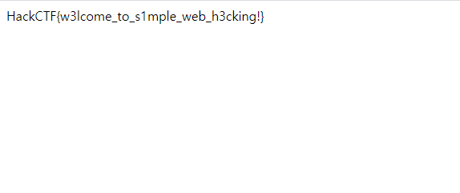

# 문제 정보
1. 문제 링크: [Link](https://ctf.j0n9hyun.xyz:2020)
2. 문제 푼 날짜: 2020-08-29
3. 분류: Web
4. 문제 이름: /

# 문제 푼 과정
Web의 첫 번째 문제인 /를 풀어보자.

문제를 보면 [https://ctf.j0n9hyun.xyz:2020](https://ctf.j0n9hyun.xyz:2020) 링크가 보이며 타고 들어가면

'Hidden Flag'와 어떤 로봇 그림 사진이 보인다.
일단 숨겨진 글씨라도 있는지 html 코드를 살펴보자.

흠.. html에는 별 다를게 없어 보인다.
그래서 사진의 URL를 따라가 보니

로봇에 관한 뉴스를 다루는 사이트라는 것을 알아내었다.
문득 예전에 구글링을 하다 알은 봇이 웹사이트를 이용하는 것을 막는 robots.txt가 있다는 것이 생각났다.

바로 URL 뒤에 /robots.txt 를 붙여 보자.

플래그가 출력되었다.
