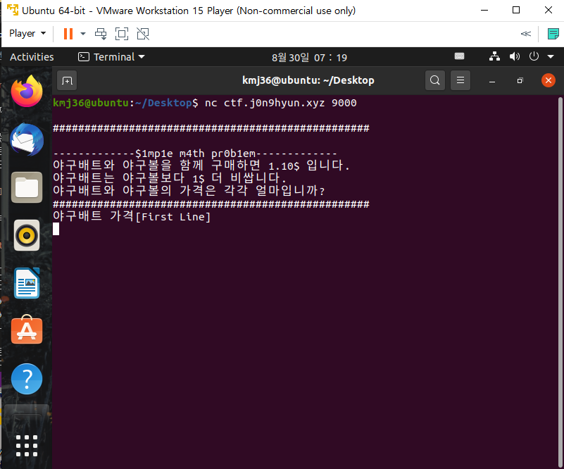

# 문제 정보
1. 문제 링크: [Link](https://ctf.j0n9hyun.xyz/challenges#Baseball%20Price)
2. 문제 푼 날짜: 2020-08-30
3. 분류: Misc
4. 문제 이름: Baseball Price

# 문제 푼 과정
기타 문제인 Misc 문제를 풀어보았다.

문제를 들어가면 먼저 nc ctf.j0n9hyun.xyz 9000 가 있다.

nc는 리눅스의 유틸리티 명령어로 네트워크 연결에서 데이터를 읽고 쓰기하는 프로그램이다.
그러므로 리눅스를 켜보자.

리눅스는 "ubuntu linux"를 Vmware로 사용하였다.

터미널을 켜서 그대로 입력했더니 이런 수학 문제가 출력되었다.
간단한 방정식문제이다.
x+y=1.1
x=y+1
이니

배트= 1.05$
야구공= 0.05$
이다.

그대로 입력 해보자.

플래그가 출력되었다.