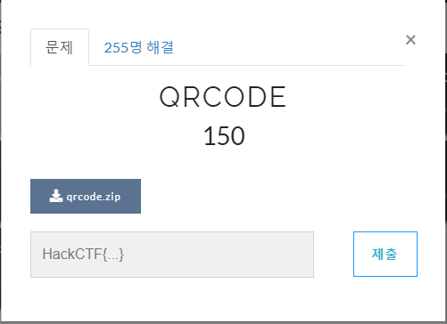
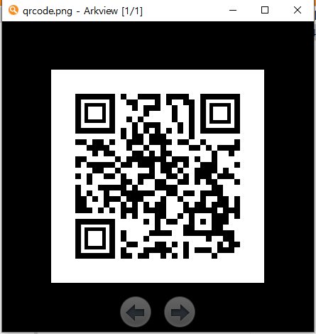
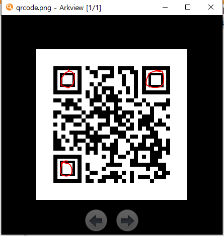
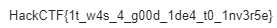

# 문제 정보
1. 문제 링크: [Link](https://ctf.j0n9hyun.xyz/challenges#QRCODE)
2. 문제 푼 날짜: 2020-08-31
3. 분류: misc
4. 문제 이름: QRCODE

# 문제 푼 과정

Misc의 QRCODE 문제를 풀어 보았다.
문제를 선택하면 qrcode.zip가 있다.

zip를 열자 QRCODE의 이미지 사진이 보인다.
그런데 스캔이 되지 않는다.

QR 코드를 보면 다른 QR 코드와 달리 3개의 면이 비어 있다.
비어있는 면은 위치 찾기 용으로 360도 어느 방향에서든 코드를 인식할 수 있게 해주는 것인데 비어 있으면 즉 어느 방향에서도 인식을 할 수 없다.

QR 코드의 빈 부분을 포토샵으로 채우고 인식하자 플래그가 출력됐다.